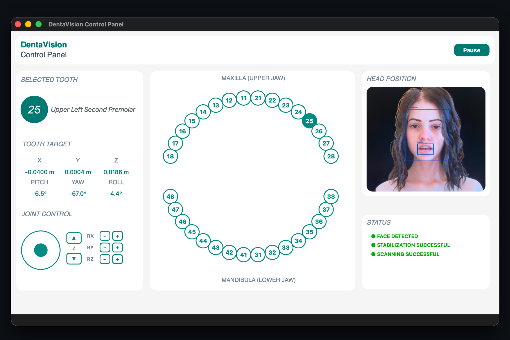

# DentaVision Control Panel


<p>
  DentaVision Control Panel is a touchscreen control panel prototype
  for intraoral dental scanning with a robot arm. It tracks a patient's
  head position through a webcam, lets an operator select a tooth from
  an on-screen dental chart, and computes the target position and
  orientation a robotic arm would need to reach that tooth.
</p>

<p>
  Target coordinates can be sent, as a manual demonstration step,
  to a separate PyBullet based UR5e simulation for testing.
</p>

<br clear="right"/>

## Features

- Live camera feed with face detection and head position and orientation tracking (MediaPipe Face Mesh)
- Stabilization check before a scan is allowed to start
- Interactive dental chart for tooth selection (upper and lower jaw)
- Automatic calculation of tooth target coordinates from the tracked head position
- Manual joint control panel 
- Status indicators and terminal messages for camera, tracking, and scan state
- Demo command output for testing against a PyBullet UR5e simulation

## Requirements

- Python 3.10+
- PySide6
- OpenCV (`opencv-python`)
- MediaPipe

Install dependencies:

```bash
pip3 install PySide6 opencv-python mediapipe
```

## Running

```bash
python3 main.py
```

A webcam is required. The application selects a platform-appropriate camera backend automatically (AVFoundation on macOS, DirectShow on Windows, V4L2 on Linux).

## Project Structure

```
core/         Python logic (tooth target calculation, data), no Qt dependency
vision/       Camera access and head pose/orientation estimation
controllers/  Application logic connecting vision, core, and UI
ui/           PySide6 widgets and Qt layout
main.py       Application entry point
```

## Known Issues

- Camera behavior can differ depending on the OpenCV backend in use; results may vary across operating systems
- Primarily developed and tested on macOS